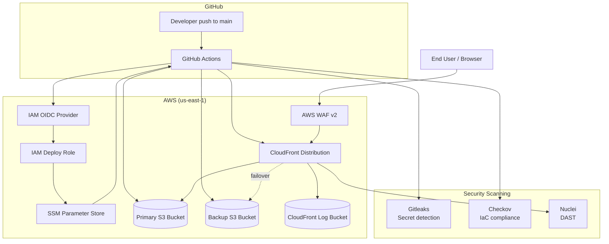
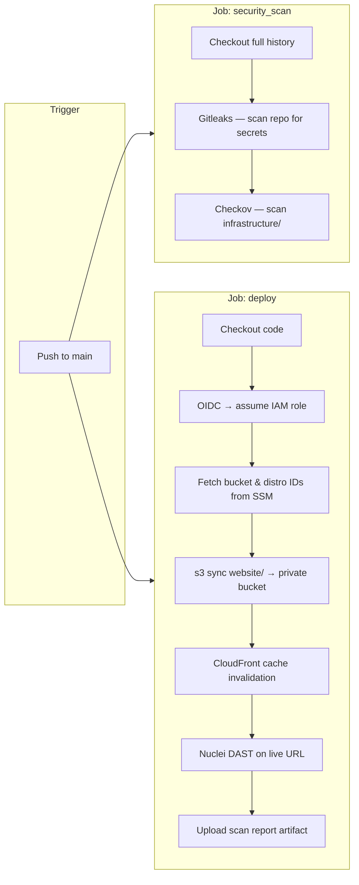
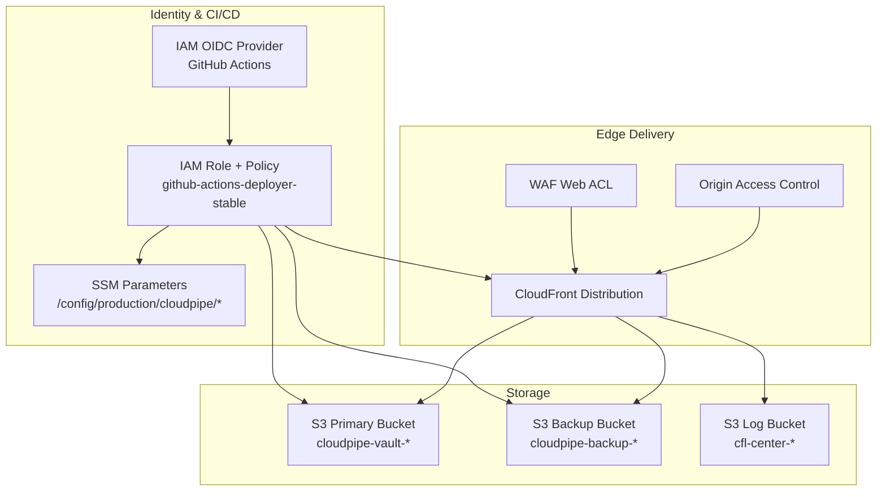

# CloudPipe Deploy

A secure, hands-free CI/CD pipeline for deploying static web applications to AWS. Infrastructure is defined in Terraform, deployments run through GitHub Actions with **OIDC federation** (no long-lived AWS keys), and every release passes through **shift-left security scanning** before and after it goes live.

This project demonstrates a production-minded pattern: scan code and infrastructure early, deploy through least-privilege automation, and validate the running site with dynamic application security testing (DAST).

---

## What This Project Does

| Layer | What happens |
|-------|----------------|
| **Infrastructure** | Terraform provisions a private S3 origin, CloudFront CDN, WAF, IAM OIDC trust, and SSM parameters |
| **Pre-deploy scanning** | Gitleaks hunts secrets; Checkov audits Terraform for misconfigurations |
| **Deployment** | GitHub Actions assumes an IAM role via OIDC, syncs `website/` to S3, and invalidates CloudFront |
| **Post-deploy scanning** | Nuclei runs DAST against the live CloudFront URL and uploads a report artifact |

The sample app in `website/` is a static portfolio site — the same pipeline pattern works for any static frontend (HTML/CSS/JS, SPAs, generated docs, etc.).

---

## Architecture Overview

Traffic never hits S3 directly. CloudFront is the only public entry point; WAF filters requests at the edge; OAC keeps the origin bucket private.



---

## CI/CD Pipeline Flow

Every push to `main` triggers the workflow in [`.github/workflows/deploy.yml`](.github/workflows/deploy.yml).



> **Note:** `security_scan` and `deploy` currently run **in parallel**. To block deployment until scans pass, add `needs: security_scan` to the `deploy` job.

---

## Security Model

### Shift-left (before deploy)

| Tool | Type | Scope | Purpose |
|------|------|-------|---------|
| **Gitleaks** | Secret scanning (SAST) | Entire repository, including `website/` | Detects hardcoded API keys, tokens, and credentials in source and git history |
| **Checkov** | Infrastructure SAST | `infrastructure/` Terraform | Catches insecure AWS defaults — public buckets, missing encryption, overly permissive policies |

Gitleaks scans web assets (`website/*.html`, `js/`, `css/`) for accidentally committed secrets. Checkov validates that the Terraform backing the pipeline follows cloud security best practices.

### Deploy-time controls

| Control | Why it matters |
|---------|----------------|
| **GitHub OIDC → IAM** | No static `AWS_ACCESS_KEY_ID` / secret in GitHub; credentials expire after the job |
| **Branch + repo trust policy** | Only `GreatOne33/cloudpipe-deploy` on `main` can assume the deploy role |
| **Least-privilege IAM policy** | Role can sync specific S3 buckets, invalidate one CloudFront distro, and read SSM under a fixed prefix — nothing else |
| **SSM-driven config** | Bucket name and distribution ID live in AWS, not hardcoded in the workflow |
| **Pinned action SHAs** | Third-party actions referenced by immutable commit hash, not floating tags |
| **Log masking** | S3 bucket and distribution ID masked in CI output |

### Runtime / edge (AWS)

| Control | Why it matters |
|---------|----------------|
| **Private S3 + OAC** | Objects are not publicly readable; only CloudFront can fetch them |
| **Public access block** | All buckets reject public ACLs and public policies |
| **SSE-S3 encryption** | Data at rest encrypted with AES-256 |
| **HTTPS only** | CloudFront redirects HTTP → HTTPS; minimum TLS 1.2 |
| **AWS WAF** | Managed bad-input rules + per-IP rate limiting (300 req / 5 min) |
| **Security response headers** | CloudFront attaches HSTS, `X-Content-Type-Options`, frame options, etc. |
| **Origin failover** | Primary + backup S3 buckets for availability |
| **Access logging** | CloudFront logs written to a dedicated private bucket |

### Shift-right (after deploy)

| Tool | Type | Scope | Purpose |
|------|------|-------|---------|
| **Nuclei** | DAST | Live CloudFront URL | Probes the deployed site for known vulnerability signatures (critical, high, medium severity) |

DAST runs against what users actually reach — the CloudFront edge URL — not the private S3 origin. Results are saved as a GitHub Actions artifact (`nuclei-security-report`, 7-day retention).

---

## Project Structure

```
cloudpipe-deploy/
├── .github/
│   └── workflows/
│       └── deploy.yml          # CI/CD pipeline — scan, deploy, DAST
├── infrastructure/
│   ├── main.tf                 # AWS resources (S3, CloudFront, WAF, IAM, SSM)
│   ├── providers.tf            # Terraform & AWS provider config
│   └── backend.tf              # Remote state in S3
├── website/                    # Static site synced to S3 on deploy
│   ├── index.html
│   ├── css/style.css
│   └── js/app.js
└── README.md
```

---

## AWS Resources (Terraform)

Terraform in `infrastructure/` creates:



Key SSM parameters written by Terraform (read by the pipeline at deploy time):

| Parameter | Used for |
|-----------|----------|
| `/config/production/cloudpipe/cicd_role_arn` | IAM role ARN for OIDC login |
| `/config/production/cloudpipe/cicd_website_bucket` | Target S3 bucket for `aws s3 sync` |
| `/config/production/cloudpipe/cloudfront_distribution_id` | Cache invalidation |
| `/config/production/cloudpipe/cloudfront_domain` | Nuclei DAST target URL |

---

## Prerequisites

- **AWS account** with permissions to create S3, CloudFront, IAM, WAF, and SSM resources
- **Terraform** >= 1.15
- **AWS CLI** configured locally (`aws configure` or SSO)
- **GitHub CLI** (`gh`) authenticated — used by Terraform to configure the GitHub provider
- **GitHub repository** with Actions enabled

---

## Getting Started

### 1. Provision infrastructure

```bash
cd infrastructure
terraform init
terraform plan
terraform apply
```

State is stored remotely in the S3 backend defined in `backend.tf`.

After apply, note the `cloudfront_domain` output — that is the live site URL.

### 2. Configure GitHub

Add a repository secret:

| Secret | Value |
|--------|-------|
| `AWS_ROLE_ARN` | `arn:aws:iam::<account-id>:role/github-actions-deployer-stable` |

This is also written to SSM at `/config/production/cloudpipe/cicd_role_arn`.

### 3. Deploy the website

Push to `main` (or merge a PR). GitHub Actions will:

1. Run Gitleaks and Checkov
2. Authenticate to AWS via OIDC
3. Sync `website/` to the private S3 bucket
4. Invalidate CloudFront
5. Run Nuclei against the live URL
6. Upload the DAST report as an artifact

### 4. View results

- **Workflow run:** GitHub → Actions → *Secure Website CI/CD Pipeline*
- **DAST report:** Download the `nuclei-security-report` artifact from the deploy job
- **Live site:** Use the `cloudfront_domain` Terraform output or the SSM parameter

---

## Making Changes

| Change type | Where to edit | What happens on push to `main` |
|-------------|---------------|--------------------------------|
| Website content | `website/` | Synced to S3, cache invalidated, DAST re-run |
| Infrastructure | `infrastructure/` | Checkov validates on next run; apply Terraform locally or via your IaC workflow |
| Pipeline logic | `.github/workflows/deploy.yml` | Workflow executes with updated steps |

---

## Design Decisions (Summary)

**Why OIDC instead of access keys?**  
Access keys in GitHub Secrets are long-lived and high-impact if leaked. OIDC exchanges a short-lived GitHub JWT for temporary AWS credentials scoped to a single role.

**Why SSM instead of hardcoded bucket names?**  
Deploy targets can change (new bucket, new distribution) without editing the workflow. The pipeline reads live values at runtime.

**Why private S3 + CloudFront?**  
Direct S3 website hosting exposes the origin and bypasses WAF, TLS policy, and security headers. OAC lets CloudFront read private objects without making the bucket public.

**Why scan before and after deploy?**  
Checkov and Gitleaks catch problems in code. Nuclei catches misconfigurations and vulnerabilities visible only on the running site — together they cover the full delivery path.

---

## License

This project is used for cloud security and infrastructure portfolio demonstration.
